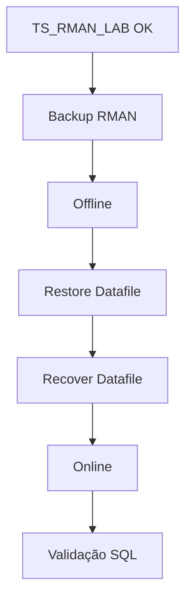

# Revisao do Modulo 3 - aula 4

> Revisao pratica do modulo 3: backup, recuperacao, `ARCHIVELOG`, `FRA`, `Data Pump` e `RMAN` em Oracle.

## Ideia central

O modulo 3 responde a uma pergunta operacional:

```txt
Se algo der errado, como eu restauro o ambiente com seguranca?
```

Para isso, vamos separar quatro conceitos:

- `Data Pump` - dump logico de schemas, tabelas, dados e metadados.
- `ARCHIVELOG` - preserva redo logs arquivados para recuperacao.
- `FRA` - area gerenciada pelo Oracle para arquivos de recuperacao.
- `RMAN` - ferramenta principal para backup fisico, restore e recovery.

## 1. Backup logico x backup fisico

### Backup logico

Trabalha com objetos Oracle:

- schemas;
- tabelas;
- indices;
- constraints;
- grants;
- dados.

Ferramentas:

- `expdp`
- `impdp`

### Backup fisico

Trabalha com a estrutura fisica do banco:

- datafiles;
- control files;
- archived logs;
- `SPFILE`;
- backups gerados pelo `RMAN`.

Ferramenta:

- `RMAN`

### Regra pratica

```txt
Data Pump = copiar objetos e dados
RMAN = proteger e recuperar o banco fisico
```

## 2. Ambiente padrao da aula

Usaremos a mesma versao padronizada no curso:

- container: `oracle-free-full-23ai`
- imagem: `container-registry.oracle.com/database/free:latest`
- porta host: `1522`
- porta interna: `1521`
- service name: `FREEPDB1`
- senha: `OraclePwd123`

Subir pelo script:

```bash
cd repo/oracle/versoes/free-full-23ai/script
./up.sh
```

Comando explicito equivalente:

```bash
podman run -d \
  --name oracle-free-full-23ai \
  -p 1522:1521 \
  --cap-add SYS_NICE \
  -e ORACLE_PWD=OraclePwd123 \
  -e ORACLE_PDB=FREEPDB1 \
  -v oracle-free-full-23ai-data:/opt/oracle/oradata:Z \
  container-registry.oracle.com/database/free:latest
```

Validar:

```bash
podman ps
podman logs -f oracle-free-full-23ai
```

## 3. Binarios usados na pratica

Algumas atividades rodam melhor dentro do container Oracle.

Entrar no container:

```bash
podman exec -it oracle-free-full-23ai bash
```

Validar binarios:

```bash
command -v sqlplus
command -v expdp
command -v impdp
command -v rman
```

Testar rapidamente:

```bash
sqlplus -v
expdp help=y | head
impdp help=y | head
rman -h | head
```

### O que e cada binario

- `sqlplus` - cliente nativo para SQL e comandos administrativos.
- `expdp` - exporta dump logico Oracle.
- `impdp` - importa dump logico Oracle.
- `rman` - faz backup fisico, restore, recovery, validacao e catalogo.

## 4. Checklist SQL inicial

Executar no cliente SQL ou via `SQL*Plus`.

Conexao recomendada para consultas:

```txt
Host: localhost
Port: 1522
Service Name: FREEPDB1
User: system
Password: OraclePwd123
```

Queries:

```sql
SELECT instance_name,
       status
FROM v$instance;

SELECT name,
       open_mode,
       log_mode
FROM v$database;

SELECT SYS_CONTEXT('USERENV', 'CON_NAME') AS current_container
FROM dual;

SELECT con_id,
       name,
       open_mode
FROM v$pdbs
ORDER BY con_id;
```

## 5. Preparar diretorios no container

Criar diretorios fisicos para o laboratorio:

```bash
podman exec -it oracle-free-full-23ai mkdir -p /opt/oracle/labbackup/fra
podman exec -it oracle-free-full-23ai mkdir -p /opt/oracle/labbackup/rman
podman exec -it oracle-free-full-23ai mkdir -p /opt/oracle/labbackup/dpump
```

Validar:

```bash
podman exec -it oracle-free-full-23ai ls -lah /opt/oracle/labbackup
```

## 6. Configurar FRA

A `FRA` e configurada no `CDB$ROOT`, como `SYSDBA`.

Conectar pelo terminal do host:

```bash
podman exec -it oracle-free-full-23ai bash -lc "sqlplus / as sysdba"
```

Configurar:

```sql
ALTER SYSTEM SET db_recovery_file_dest_size = 10G SCOPE=BOTH;
ALTER SYSTEM SET db_recovery_file_dest = '/opt/oracle/labbackup/fra' SCOPE=BOTH;
```

Validar:

```sql
SELECT name,
       value
FROM v$parameter
WHERE name IN ('db_recovery_file_dest', 'db_recovery_file_dest_size')
ORDER BY name;
```

## 7. Habilitar ARCHIVELOG

Este bloco reinicia o banco. Use em laboratorio.

Ainda como `SYSDBA`, primeiro verificar:

```sql
SELECT log_mode
FROM v$database;
```

Se o resultado ja for `ARCHIVELOG`, pular os comandos de reinicio.

Se o resultado for `NOARCHIVELOG`, executar:

```sql
SHUTDOWN IMMEDIATE;
STARTUP MOUNT;

ALTER DATABASE ARCHIVELOG;
ALTER DATABASE OPEN;
ALTER PLUGGABLE DATABASE ALL OPEN;

SELECT log_mode
FROM v$database;
```

Validar PDB:

```sql
SELECT con_id,
       name,
       open_mode
FROM v$pdbs
ORDER BY con_id;
```

Sair:

```sql
EXIT;
```

## 8. Criar schema de laboratorio

Conectar na PDB como `SYSTEM` pelo terminal do host:

```bash
podman exec -it oracle-free-full-23ai sqlplus system/OraclePwd123@//localhost:1521/FREEPDB1
```

Criar tablespace dedicada para o laboratorio:

```sql
CREATE TABLESPACE ts_rman_lab
  DATAFILE '/opt/oracle/oradata/FREE/FREEPDB1/ts_rman_lab01.dbf'
  SIZE 100M
  AUTOEXTEND ON NEXT 50M MAXSIZE 500M;
```

Validar se a tablespace foi criada:

```sql
SELECT tablespace_name,
       status
FROM dba_tablespaces
WHERE tablespace_name = 'TS_RMAN_LAB';

SELECT file_id,
       file_name,
       tablespace_name,
       status
FROM dba_data_files
WHERE tablespace_name = 'TS_RMAN_LAB';
```

Criar usuarios:

```sql
CREATE USER app_rman IDENTIFIED BY AppRman123
  DEFAULT TABLESPACE ts_rman_lab
  TEMPORARY TABLESPACE TEMP
  QUOTA UNLIMITED ON ts_rman_lab;

CREATE USER app_rman_clone IDENTIFIED BY AppRmanClone123
  DEFAULT TABLESPACE ts_rman_lab
  TEMPORARY TABLESPACE TEMP
  QUOTA UNLIMITED ON ts_rman_lab;

GRANT CREATE SESSION, CREATE TABLE, CREATE SEQUENCE TO app_rman;
GRANT CREATE SESSION, CREATE TABLE, CREATE SEQUENCE TO app_rman_clone;
```

Criar diretório logico para Data Pump:

```sql
CREATE OR REPLACE DIRECTORY dpump_mod3_dir AS '/opt/oracle/labbackup/dpump';

GRANT READ, WRITE ON DIRECTORY dpump_mod3_dir TO system;
GRANT READ, WRITE ON DIRECTORY dpump_mod3_dir TO app_rman;
GRANT READ, WRITE ON DIRECTORY dpump_mod3_dir TO app_rman_clone;
```

Sair:

```sql
EXIT;
```

## 9. Criar tabela e dados

Conectar como `APP_RMAN`:

```bash
podman exec -it oracle-free-full-23ai sqlplus app_rman/AppRman123@//localhost:1521/FREEPDB1
```

Criar tabela:

```sql
CREATE TABLE pedidos_lab (
  id_pedido   NUMBER PRIMARY KEY,
  cliente     VARCHAR2(100),
  valor_total NUMBER(10,2),
  criado_em   DATE DEFAULT SYSDATE
);

INSERT INTO pedidos_lab (id_pedido, cliente, valor_total)
VALUES (1, 'Cliente A', 150.00);

INSERT INTO pedidos_lab (id_pedido, cliente, valor_total)
VALUES (2, 'Cliente B', 280.00);

INSERT INTO pedidos_lab (id_pedido, cliente, valor_total)
VALUES (3, 'Cliente C', 490.00);

COMMIT;
```

Validar:

```sql
SELECT *
FROM pedidos_lab
ORDER BY id_pedido;

SELECT table_name,
       tablespace_name
FROM user_tables
WHERE table_name = 'PEDIDOS_LAB';
```

O resultado esperado e:

```text
PEDIDOS_LAB  TS_RMAN_LAB
```

Se aparecer `USERS`, a tabela foi criada antes da correcao do laboratorio ou o usuario nao estava usando a tablespace correta.

Corrigir antes de fazer o backup RMAN:

```sql
ALTER TABLE pedidos_lab MOVE TABLESPACE ts_rman_lab;

SELECT table_name,
       tablespace_name
FROM user_tables
WHERE table_name = 'PEDIDOS_LAB';
```

Sair:

```sql
EXIT;
```

## 10. Data Pump na pratica

### Exportar schema com `expdp`

No terminal do host:

```bash
podman exec -it oracle-free-full-23ai expdp system/OraclePwd123@//localhost:1521/FREEPDB1 \
  DIRECTORY=dpump_mod3_dir \
  DUMPFILE=app_rman_m3.dmp \
  LOGFILE=app_rman_m3_exp.log \
  SCHEMAS=APP_RMAN
```

Validar arquivos:

```bash
podman exec -it oracle-free-full-23ai ls -lah /opt/oracle/labbackup/dpump
podman exec -it oracle-free-full-23ai cat /opt/oracle/labbackup/dpump/app_rman_m3_exp.log
```

### Importar com `impdp`

No terminal do host:

```bash
podman exec -it oracle-free-full-23ai impdp system/OraclePwd123@//localhost:1521/FREEPDB1 \
  DIRECTORY=dpump_mod3_dir \
  DUMPFILE=app_rman_m3.dmp \
  LOGFILE=app_rman_m3_imp.log \
  REMAP_SCHEMA=APP_RMAN:APP_RMAN_CLONE
```

Validar import:

```bash
podman exec -it oracle-free-full-23ai sqlplus app_rman_clone/AppRmanClone123@//localhost:1521/FREEPDB1
```

```sql
SELECT table_name
FROM user_tables
ORDER BY table_name;

SELECT *
FROM pedidos_lab
ORDER BY id_pedido;

EXIT;
```

## 11. RMAN na pratica

Entrar no RMAN pelo terminal do host:

```bash
podman exec -it oracle-free-full-23ai bash -lc "rman target /"
```

Configurar:

```rman
CONFIGURE CONTROLFILE AUTOBACKUP ON;
CONFIGURE RETENTION POLICY TO RECOVERY WINDOW OF 7 DAYS;
SHOW ALL;
```

Backup fisico do banco:

```rman
BACKUP AS BACKUPSET DATABASE
  FORMAT '/opt/oracle/labbackup/rman/db_%U.bkp';
```

Backup dos archived logs:

```rman
BACKUP AS BACKUPSET ARCHIVELOG ALL
  FORMAT '/opt/oracle/labbackup/rman/arch_%U.bkp';
```

Validar:

```rman
LIST BACKUP SUMMARY;
VALIDATE DATABASE;
RESTORE DATABASE VALIDATE;
CROSSCHECK BACKUP;
CROSSCHECK ARCHIVELOG ALL;
```

Sair:

```rman
EXIT;
```

Validar arquivos no host:

```bash
podman exec -it oracle-free-full-23ai ls -lah /opt/oracle/labbackup/rman
```

## 12. Consultas de observacao

### FRA

```sql
SELECT name,
       space_limit / 1024 / 1024 AS fra_limit_mb,
       space_used / 1024 / 1024 AS fra_used_mb,
       space_reclaimable / 1024 / 1024 AS fra_reclaimable_mb
FROM v$recovery_file_dest;
```

### Archived logs

```sql
SELECT sequence#,
       archived,
       status,
       first_time
FROM v$archived_log
ORDER BY sequence# DESC
FETCH FIRST 20 ROWS ONLY;
```

### Jobs RMAN

```sql
SELECT session_key,
       input_type,
       status,
       start_time,
       end_time
FROM v$rman_backup_job_details
ORDER BY start_time DESC
FETCH FIRST 10 ROWS ONLY;
```

## 13. Restore e recovery

Para esta revisao, o restore deve usar uma tablespace dedicada.

Nao usar `USERS` neste laboratorio.

Motivo:

- `USERS` pode existir no `CDB$ROOT` e na `PDB`;
- em ambiente multitenant, isso pode confundir o alvo do restore;
- o erro `ORA-19573` / `ORA-19890` aparece quando o datafile que o RMAN tentou restaurar ainda esta em uso;
- com `TS_RMAN_LAB`, o alvo fica isolado, visivel e seguro para a demonstracao.

Fluxo mental do teste:


### 13.1. Identificar o datafile correto

Conectar como `SYSDBA`:

```bash
podman exec -it oracle-free-full-23ai bash -lc "sqlplus / as sysdba"
```

Executar:

```sql
ALTER SESSION SET CONTAINER = FREEPDB1;

SELECT file_id,
       file_name,
       tablespace_name,
       status
FROM dba_data_files
WHERE tablespace_name = 'TS_RMAN_LAB';
```

Anotar o `FILE_ID` retornado.

Se retornar `no rows selected`, a tablespace `TS_RMAN_LAB` ainda nao existe na `FREEPDB1`.

Nesse caso, ainda como `SYSDBA`, executar:

```sql
ALTER SESSION SET CONTAINER = FREEPDB1;

SELECT tablespace_name,
       status
FROM dba_tablespaces
ORDER BY tablespace_name;

CREATE TABLESPACE ts_rman_lab
  DATAFILE '/opt/oracle/oradata/FREE/FREEPDB1/ts_rman_lab01.dbf'
  SIZE 100M
  AUTOEXTEND ON NEXT 50M MAXSIZE 500M;

SELECT file_id,
       file_name,
       tablespace_name,
       status
FROM dba_data_files
WHERE tablespace_name = 'TS_RMAN_LAB';
```

Se `APP_RMAN` e `APP_RMAN_CLONE` ja tinham sido criados antes usando outra tablespace, o caminho mais limpo para aula e recriar os usuarios:

```sql
DROP USER app_rman_clone CASCADE;
DROP USER app_rman CASCADE;
```

Depois, voltar ao passo `8. Criar schema de laboratorio`, criar os usuarios novamente e refazer o backup antes do restore.

Exemplo:

```text
FILE_ID  FILE_NAME                                              TABLESPACE_NAME  STATUS
------   -----------------------------------------------------  ---------------  ---------
18       /opt/oracle/oradata/FREE/FREEPDB1/ts_rman_lab01.dbf   TS_RMAN_LAB      AVAILABLE
```

Sair:

```sql
EXIT;
```

### 13.2. Fazer backup antes do teste

Entrar no RMAN:

```bash
podman exec -it oracle-free-full-23ai bash -lc "rman target /"
```

Executar backup:

```rman
BACKUP AS BACKUPSET DATABASE
  FORMAT '/opt/oracle/labbackup/rman/db_%U.bkp';

BACKUP AS BACKUPSET ARCHIVELOG ALL
  FORMAT '/opt/oracle/labbackup/rman/arch_%U.bkp';

LIST BACKUP SUMMARY;
EXIT;
```

### 13.3. Colocar a tablespace offline

Conectar como `SYSDBA`:

```bash
podman exec -it oracle-free-full-23ai bash -lc "sqlplus / as sysdba"
```

Executar:

```sql
ALTER SESSION SET CONTAINER = FREEPDB1;
ALTER TABLESPACE ts_rman_lab OFFLINE IMMEDIATE;

SELECT tablespace_name,
       status
FROM dba_tablespaces
WHERE tablespace_name = 'TS_RMAN_LAB';

SELECT file#,
       name,
       status,
       enabled
FROM v$datafile
WHERE name LIKE '%ts_rman_lab01.dbf';

EXIT;
```

### 13.4. Restaurar e recuperar o datafile

Antes de restaurar, confirmar novamente o `FILE_ID`.

Conectar como `SYSDBA`:

```bash
podman exec -it oracle-free-full-23ai bash -lc "sqlplus / as sysdba"
```

Executar:

```sql
ALTER SESSION SET CONTAINER = FREEPDB1;

SELECT file_id,
       file_name,
       tablespace_name,
       status
FROM dba_data_files
WHERE tablespace_name = 'TS_RMAN_LAB';

EXIT;
```

Entrar no RMAN:

```bash
podman exec -it oracle-free-full-23ai bash -lc "rman target /"
```

Executar usando o numero real do `FILE_ID` encontrado na etapa anterior.

Importante: nao copiar `<FILE_ID>` literalmente. Ele e apenas um marcador para substituir pelo numero retornado na consulta.

```rman
RESTORE DATAFILE <FILE_ID>;
RECOVER DATAFILE <FILE_ID>;
EXIT;
```

Exemplo, se o `FILE_ID` for `18`:

```rman
RESTORE DATAFILE 18;
RECOVER DATAFILE 18;
EXIT;
```

### 13.5. Colocar a tablespace online novamente

Importante: nao executar `ALTER SESSION SET CONTAINER` dentro do RMAN.

O RMAN faz `RESTORE` e `RECOVER`.

O comando para colocar a tablespace ou datafile online deve ser feito no `SQL*Plus`, conectado como `SYSDBA`.

Conectar como `SYSDBA`:

```bash
podman exec -it oracle-free-full-23ai bash -lc "sqlplus / as sysdba"
```

Executar:

```sql
ALTER SESSION SET CONTAINER = FREEPDB1;
ALTER TABLESPACE ts_rman_lab ONLINE;

SELECT tablespace_name,
       status
FROM dba_tablespaces
WHERE tablespace_name = 'TS_RMAN_LAB';

SELECT file#,
       name,
       status,
       enabled
FROM v$datafile
WHERE name LIKE '%ts_rman_lab01.dbf';

EXIT;
```

Se a tablespace nao voltar com `ALTER TABLESPACE`, colocar o datafile online pelo caminho completo:

```sql
ALTER SESSION SET CONTAINER = FREEPDB1;

ALTER DATABASE DATAFILE '/opt/oracle/oradata/FREE/FREEPDB1/ts_rman_lab01.dbf' ONLINE;

SELECT file#,
       name,
       status,
       enabled
FROM v$datafile
WHERE name LIKE '%ts_rman_lab01.dbf';

EXIT;
```

### 13.6. Validar os dados

Conectar como `APP_RMAN`:

```bash
podman exec -it oracle-free-full-23ai sqlplus app_rman/AppRman123@//localhost:1521/FREEPDB1
```

Executar:

```sql
SELECT *
FROM pedidos_lab
ORDER BY id_pedido;

SELECT table_name,
       tablespace_name
FROM user_tables
WHERE table_name = 'PEDIDOS_LAB';

EXIT;
```

### 13.7. Confirmação completa do fluxo

Este bloco serve para repetir o teste de ponta a ponta depois que o ambiente ja esta preparado.

Objetivo:

```text
backup -> offline -> restore -> recover -> online -> validacao
```

#### 13.7.1. Descobrir o `FILE_ID`

```bash
podman exec -it oracle-free-full-23ai bash -lc "sqlplus / as sysdba"
```

```sql
ALTER SESSION SET CONTAINER = FREEPDB1;

SELECT file_id,
       file_name,
       tablespace_name,
       status
FROM dba_data_files
WHERE tablespace_name = 'TS_RMAN_LAB';

EXIT;
```

Guardar o `FILE_ID` retornado.

#### 13.7.2. Fazer backup RMAN

```bash
podman exec -it oracle-free-full-23ai bash -lc "rman target /"
```

```rman
BACKUP AS BACKUPSET DATABASE
  FORMAT '/opt/oracle/labbackup/rman/db_%U.bkp';

BACKUP AS BACKUPSET ARCHIVELOG ALL
  FORMAT '/opt/oracle/labbackup/rman/arch_%U.bkp';

LIST BACKUP SUMMARY;
EXIT;
```

#### 13.7.3. Colocar a tablespace offline

```bash
podman exec -it oracle-free-full-23ai bash -lc "sqlplus / as sysdba"
```

```sql
ALTER SESSION SET CONTAINER = FREEPDB1;

ALTER TABLESPACE ts_rman_lab OFFLINE IMMEDIATE;

SELECT tablespace_name,
       status
FROM dba_tablespaces
WHERE tablespace_name = 'TS_RMAN_LAB';

EXIT;
```

#### 13.7.4. Restaurar e recuperar

Trocar `16` pelo `FILE_ID` real do ambiente.

```bash
podman exec -it oracle-free-full-23ai bash -lc "rman target /"
```

```rman
RESTORE DATAFILE 16;
RECOVER DATAFILE 16;
EXIT;
```

#### 13.7.5. Colocar online

```bash
podman exec -it oracle-free-full-23ai bash -lc "sqlplus / as sysdba"
```

```sql
ALTER SESSION SET CONTAINER = FREEPDB1;

ALTER TABLESPACE ts_rman_lab ONLINE;

SELECT tablespace_name,
       status
FROM dba_tablespaces
WHERE tablespace_name = 'TS_RMAN_LAB';

SELECT file#,
       name,
       status,
       enabled
FROM v$datafile
WHERE name LIKE '%ts_rman_lab01.dbf';

EXIT;
```

#### 13.7.6. Validar dados

```bash
podman exec -it oracle-free-full-23ai sqlplus app_rman/AppRman123@//localhost:1521/FREEPDB1
```

```sql
SELECT *
FROM pedidos_lab
ORDER BY id_pedido;

SELECT table_name,
       tablespace_name
FROM user_tables
WHERE table_name = 'PEDIDOS_LAB';

EXIT;
```

Resultado esperado:

```text
PEDIDOS_LAB  TS_RMAN_LAB
```

### 13.8. Correção se a tabela ficou em `USERS`

Este bloco nao faz parte do fluxo principal.

Usar somente se o laboratorio foi executado antes da criacao da `TS_RMAN_LAB` e a tabela ficou em `USERS`.

Diagnosticar como `SYSDBA`:

```bash
podman exec -it oracle-free-full-23ai bash -lc "sqlplus / as sysdba"
```

```sql
ALTER SESSION SET CONTAINER = FREEPDB1;

SELECT owner,
       table_name,
       tablespace_name
FROM dba_tables
WHERE table_name = 'PEDIDOS_LAB'
ORDER BY owner;

SELECT file#,
       name,
       status,
       enabled
FROM v$datafile
WHERE name LIKE '%users01.dbf';

SELECT tablespace_name,
       status
FROM dba_tablespaces
WHERE tablespace_name = 'USERS';

EXIT;
```

Se o datafile `users01.dbf` estiver offline ou em recovery, recuperar com RMAN:

```bash
podman exec -it oracle-free-full-23ai bash -lc "rman target /"
```

```rman
RESTORE DATAFILE 15;
RECOVER DATAFILE 15;
EXIT;
```

Importante: trocar `15` pelo `FILE#` real do `users01.dbf`, se no seu ambiente for outro numero.

Depois, colocar o datafile/tablespace online pelo `SQL*Plus`, nao pelo RMAN:

```bash
podman exec -it oracle-free-full-23ai bash -lc "sqlplus / as sysdba"
```

```sql
ALTER SESSION SET CONTAINER = FREEPDB1;

ALTER DATABASE DATAFILE '/opt/oracle/oradata/FREE/FREEPDB1/users01.dbf' ONLINE;
ALTER TABLESPACE users ONLINE;

SELECT file#,
       name,
       status,
       enabled
FROM v$datafile
WHERE name LIKE '%users01.dbf';

EXIT;
```

Agora mover a tabela para a tablespace correta:

```bash
podman exec -it oracle-free-full-23ai sqlplus app_rman/AppRman123@//localhost:1521/FREEPDB1
```

```sql
ALTER TABLE pedidos_lab MOVE TABLESPACE ts_rman_lab;

SELECT table_name,
       tablespace_name
FROM user_tables
WHERE table_name = 'PEDIDOS_LAB';

EXIT;
```

Depois dessa correção, refazer o backup RMAN antes de qualquer novo teste de restore.

### 13.9. Restore completo do banco

Restore completo do banco fica apenas como explicacao nesta aula.

Ele exige janela controlada, banco montado, avaliacao de impacto e cuidado com arquivos fisicos.

Exemplo conceitual:

```rman
RESTORE DATABASE;
RECOVER DATABASE;
```

## 14. Limpeza opcional

Conectar como `SYSTEM` em `FREEPDB1`:

```sql
DROP USER app_rman_clone CASCADE;
DROP USER app_rman CASCADE;
DROP TABLESPACE ts_rman_lab INCLUDING CONTENTS AND DATAFILES;
DROP DIRECTORY dpump_mod3_dir;
```

Arquivos do laboratorio:

```bash
podman exec -it oracle-free-full-23ai rm -rf /opt/oracle/labbackup/dpump/*
podman exec -it oracle-free-full-23ai rm -rf /opt/oracle/labbackup/rman/*
```

## 15. Resultado esperado

Ao final da revisao, precisa ficar claro:

- `expdp` e `impdp` resolvem dump logico;
- `ARCHIVELOG` amplia a capacidade de recuperacao;
- `FRA` organiza arquivos de recovery;
- `RMAN` protege a estrutura fisica do banco;
- backup precisa ser validado;
- restore real deve ser testado em ambiente controlado.

## Referencias internas

- `modulo3-material/03-teoria-modulo3.md`
- `modulo3-material/03-pratica-modulo3.md`
