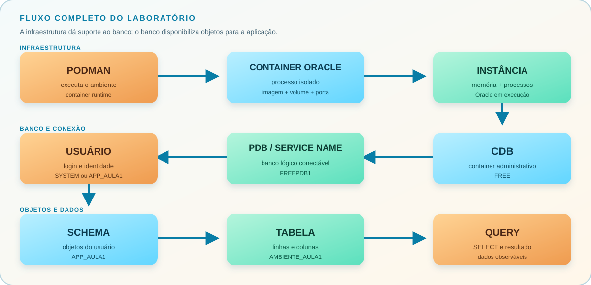

# Aula 1 - Módulo 1: Fundamentos do Oracle

Esta aula estabelece a base para trabalhar com Oracle de forma segura e consciente. A proposta é sair da conexão inicial e chegar a uma tabela consultável, entendendo o que existe por trás de cada etapa.

## O fluxo completo

```txt
Podman
  -> container Oracle
      -> instância
          -> CDB
              -> PDB / Service Name
                  -> usuário
                      -> schema
                          -> tabela
                              -> query
```

Esse fluxo é a linha de raciocínio da aula. Quando uma operação falhar, volte para ele e descubra em qual camada está o problema.



## O que será compreendido

Ao terminar a aula, deve ser possível:

- explicar por que um SGBD é diferente de arquivos isolados;
- diferenciar instância, banco de dados, CDB e PDB;
- explicar `SID` e `Service Name` sem misturá-los;
- preencher corretamente uma conexão Oracle na IDE;
- criar um usuário e entender a relação com o schema;
- criar uma tabela, inserir dados e executar consultas;
- identificar memória, processos, arquivos e parâmetros do Oracle;
- diferenciar `PFILE` de `SPFILE`;
- identificar o container atual e alternar entre `CDB$ROOT` e uma PDB;
- explicar o papel da `PDB$SEED` na criação de novas PDBs;
- entender `FILE_NAME_CONVERT` e a relação entre PDBs e datafiles;
- diferenciar as responsabilidades de `SYSTEM`, `SYS`, `SYSDBA` e `SYSOPER`;
- criar, abrir e validar uma PDB usando a sequência administrativa correta;
- explicar em qual PDB, usuário e schema os objetos são criados.

## Como usar esta aula

O `README.md` apresenta a teoria, o fluxo mental e os comandos básicos. A execução está dividida em dois percursos práticos:

1. [Laboratório principal](./pratica.md): subir o Oracle, conectar na `FREEPDB1`, observar o ambiente, criar o usuário `APP_AULA1`, criar uma tabela e executar operações básicas.
2. [Extensão prática de PDB](./pdb.md): acessar o `CDB$ROOT`, consultar a `PDB$SEED`, criar e abrir a `DBJEFFOTONI`, alternar entre containers e entender privilégios administrativos.

Depois, use a [revisão e consolidação](./revisao.md) para verificar o entendimento.

## 1. Antes de conectar: o que está sendo executado

O Podman inicia um container. Dentro dele, a imagem Oracle inicializa uma instância e disponibiliza serviços de conexão.

```txt
Podman não é o banco.
Podman executa o ambiente onde o banco funciona.
```

O banco Oracle mantém arquivos persistentes no volume. A instância representa a parte ativa, com memória e processos. O CDB organiza o ambiente multitenant, e a PDB é o banco lógico em que a aplicação e o laboratório trabalham.

### O comando de inicialização

O comando possui parâmetros do Podman e variáveis que a imagem Oracle entende:

| Parâmetro | Significado |
| :--- | :--- |
| `--name oracle-free-full-23ai` | Nome do container no Podman. Não é o nome do CDB, da PDB ou do usuário. |
| `-p 1522:1521` | Publica a porta `1521` do Oracle como `1522` no computador. A IDE usa `1522`; o listener interno continua em `1521`. |
| `--cap-add SYS_NICE` | Adiciona ao container a capability Linux que permite aos processos Oracle ajustar prioridade e políticas de escalonamento da CPU quando necessário. |
| `-e ORACLE_PWD=OraclePwd123` | Define a senha inicial dos usuários administrativos preparados pela imagem, como `SYSTEM` e `SYS`. Não cria um usuário chamado `OraclePwd123`. |
| `-e ORACLE_PDB=FREEPDB1` | Informa o nome da PDB criada ou usada na inicialização. Esse nome é uma escolha da imagem/laboratório, não o nome do aluno. |
| `-v oracle-free-full-23ai-data:/opt/oracle/oradata:Z` | Persiste os arquivos Oracle em um volume. O caminho da esquerda é o volume; o da direita é o diretório dentro do container. |
| `container-registry.oracle.com/database/free:latest` | Imagem Oracle Free usada como base para executar o banco. |

### Por que usar `--cap-add SYS_NICE`?

Linux divide alguns privilégios administrativos em permissões menores, chamadas **capabilities**. O `--cap-add` adiciona somente uma capability ao container, em vez de liberar privilégios amplos.

No Oracle:

```bash
--cap-add SYS_NICE
```

permite que processos do banco façam determinados ajustes de prioridade e escalonamento da CPU durante a inicialização e a execução.

```txt
--cap-add SYS_NICE -> permissão específica
--privileged       -> privilégios muito amplos
```

Por isso, `SYS_NICE` segue o princípio do menor privilégio: o container recebe apenas a capacidade necessária para o Oracle funcionar, sem substituir o isolamento por `--privileged`.

### Principais capabilities Linux

`--cap-add` pode receber outras capabilities. Elas não devem ser adicionadas automaticamente: cada uma representa uma permissão específica do kernel Linux.

| Capability | Significado prático |
| :--- | :--- |
| `SYS_NICE` | Ajustar prioridade e políticas de escalonamento de processos. É a capability usada nesta imagem Oracle. |
| `SYS_RESOURCE` | Ajustar determinados limites de recursos dos processos, como arquivos e prioridades. |
| `NET_ADMIN` | Administrar interfaces, rotas, regras de firewall e configurações avançadas de rede. |
| `NET_RAW` | Usar raw sockets, necessários para algumas ferramentas de diagnóstico de rede. |
| `SYS_PTRACE` | Inspecionar e depurar processos com ferramentas como `strace` e debuggers. |
| `SYS_TIME` | Alterar o relógio do sistema. É sensível e raramente necessário em aplicações comuns. |
| `SYS_ADMIN` | Executar várias operações administrativas avançadas; é ampla e deve ser evitada quando não for indispensável. |
| `CHOWN` | Alterar o proprietário de arquivos. |
| `SETUID` / `SETGID` | Alterar a identidade de usuário ou grupo de um processo. |
| `MKNOD` | Criar arquivos especiais de dispositivos. |
| `KILL` | Enviar sinais para determinados processos. |
| `AUDIT_WRITE` | Escrever eventos no sistema de auditoria do Linux. |

Exemplo adicionando mais de uma capability:

```bash
podman run \
  --cap-add SYS_NICE \
  --cap-add SYS_RESOURCE \
  imagem-exemplo
```

Uma estratégia ainda mais restritiva é remover todas as capabilities e devolver somente a necessária:

```bash
podman run \
  --cap-drop ALL \
  --cap-add SYS_NICE \
  imagem-exemplo
```

Na prática do curso, não vamos trocar o comando Oracle para essa variação sem validar a imagem. O objetivo é entender que `--cap-add SYS_NICE` é uma concessão específica, enquanto `--privileged` amplia muito mais o acesso do container.

### Por que `FREEPDB1` e não `JEFFOTONI`, `DBAQUI` ou `DBU`?

No **Oracle Database Free** utilizado neste laboratório, a configuração padrão da imagem é:

```bash
CDB / SID: FREE
PDB padrão: FREEPDB1
```
Ou seja, nesta imagem específica do Oracle Free, não podemos simplesmente escolher qualquer nome para substituir FREEPDB1 na inicialização do container.

Por exemplo, não devemos imaginar que isto mudaria a PDB padrão:
```bash
-e ORACLE_PDB=JEFFOTONI
```
ou
```bash
-e ORACLE_PDB=DBAQUI
```

Na imagem Oracle Database Free utilizada no laboratório, a PDB padrão continua sendo:
```bash
FREEPDB1
```

No Oracle, uma PDB pode ser criada posteriormente com outro nome pelo administrador. A criação deve ocorrer no `CDB$ROOT` e, neste ambiente, precisa informar a origem e o destino dos datafiles:

```sql
CREATE PLUGGABLE DATABASE DBAQUI
ADMIN USER pdbadmin
IDENTIFIED BY Senha123
FILE_NAME_CONVERT = (
    '/opt/oracle/oradata/FREE/pdbseed/',
    '/opt/oracle/oradata/FREE/DBAQUI/'
);
```

O fluxo completo, incluindo a conexão com `SYS AS SYSDBA`, a validação dos caminhos e a abertura da PDB, está na [extensão prática de criação e administração de PDB](./pdb.md).

Também poderia ser criada uma PDB chamada:
```bash
JEFFOTONI
DBU
CURSO
TESTE
```

Desde que o nome respeite as regras de nomenclatura do Oracle e a criação seja suportada pelo ambiente.

Portanto, existe uma diferença importante:
```text
FREEPDB1
```
é a PDB padrão da imagem Oracle Database Free utilizada no laboratório.

Já nomes como:
```text
DBAQUI
JEFFOTONI
DBU
CURSO
```
podem ser usados em outras PDBs criadas posteriormente, e não simplesmente substituindo o nome da PDB padrão da imagem.

**Por que não basta trocar ORACLE_PDB?**

Porque, no Oracle Database Free utilizado neste laboratório, FREEPDB1 faz parte da configuração padrão da imagem.

Além disso, se o volume:
```text
oracle-free-full-23ai-data
```

já contém o banco inicializado, mudar uma variável no comando do container não renomeia automaticamente a PDB que já existe.

No nosso ambiente:
```text
CDB: FREE
└── PDB: FREEPDB1
```
Se quisermos outra PDB, ela deve ser criada administrativamente no Oracle, por exemplo com:
```text
CREATE PLUGGABLE DATABASE ...
```
**Por que o CDB é FREE?**

FREE é o nome padrão do database/CDB utilizado pelo Oracle Database Free nessa imagem.

Assim, no laboratório:
```text
CDB: FREE
└── PDB: FREEPDB1
```

O ponto principal é:
```text
FREE      -> CDB / SID padrão do Oracle Database Free
FREEPDB1  -> PDB padrão do Oracle Database Free
DBAQUI    -> poderia ser uma nova PDB criada posteriormente
```

Portanto, não escolhemos livremente outro nome para substituir FREEPDB1 na imagem Oracle Free do laboratório.

## 2. Os campos da conexão

Para o laboratório principal:

```txt
Host: localhost
Port: 1522
SID: FREE
Service Name: FREEPDB1
User: system ou app_aula1
```

O comando não informa `User: system` porque usuário e senha são conceitos diferentes da execução do container. A imagem já cria usuários administrativos; `ORACLE_PWD` define a senha inicial. Por isso o primeiro login normal é:

```txt
User: system
Password: OraclePwd123
Role: Normal
Service Name: FREEPDB1
```

### SID

O `SID` identifica a instância Oracle. Ele é usado quando o contexto é a instância ou uma operação administrativa específica.

### Service Name

O `Service Name` identifica o serviço para o qual a sessão será direcionada. No laboratório, `FREEPDB1` aponta para a PDB de trabalho.

### Regra prática

```txt
Para trabalhar com usuários, tabelas e aplicações, use Service Name = FREEPDB1.
```

## 3. CDB, PDB, usuário e schema

```txt
CDB = container administrativo
PDB = banco lógico conectável
User = identidade que autentica
Schema = objetos pertencentes ao usuário
Table = estrutura que armazena registros
```

No Oracle, usuário e schema caminham juntos, mas não são a mesma ideia:

- o usuário representa a identidade e o login;
- o schema representa o conjunto de objetos desse usuário;
- uma tabela criada por `APP_AULA1` normalmente pertence ao schema `APP_AULA1`.

### Quem deve fazer o primeiro login?

No laboratório, a ordem recomendada é:

```txt
1. SYSTEM     -> validar o ambiente e criar usuários
2. APP_AULA1  -> criar e consultar objetos da aplicação
3. SYS        -> usar somente quando uma operação exigir SYSDBA
```

`SYSTEM` é o primeiro login didático porque permite consultar informações administrativas e criar o usuário de laboratório. `APP_AULA1` representa a aplicação e não deve receber privilégios administrativos. `SYS` é o proprietário do dicionário Oracle e não deve ser usado como usuário comum para criar tabelas da aplicação.

### O que já existe na PDB?

Ao subir o Oracle Free, a PDB `FREEPDB1` já possui metadados, usuários administrativos, tablespaces, datafiles, serviços e objetos internos. Ela não começa vazia.

O que ainda não existe é a tabela da aplicação. Essa tabela será criada depois, pelo usuário `APP_AULA1`.

Para enxergar essa diferença, a consulta administrativa usa `DBA_*` e `V$`, enquanto a consulta da aplicação usa `USER_*`:

```txt
SYSTEM    -> DBA_USERS, DBA_TABLESPACES, DBA_DATA_FILES, V$PDBS
APP_AULA1 -> USER_TABLES, USER_OBJECTS, suas próprias tabelas
```

### Objetos que aparecem nas consultas

| Nome | Significado direto |
| :--- | :--- |
| `DBA_USERS` | Contas de usuários conhecidas pelo banco. |
| `DBA_TABLESPACES` | Armazenamento lógico do banco. |
| `DBA_DATA_FILES` | Arquivos físicos que sustentam tablespaces permanentes. |
| `DBA_OBJECTS` | Objetos registrados, como tabelas, índices, views e procedures. |
| `USER_TABLES` | Tabelas do usuário conectado. |
| `USER_OBJECTS` | Objetos do schema do usuário conectado. |
| `V$INSTANCE` | Estado da instância Oracle. |
| `V$DATABASE` | Nome, modo de abertura e arquitetura do banco. |
| `V$PDBS` | PDBs e seus estados de abertura. |
| `V$PARAMETER` | Parâmetros usados pela instância. |

`SYSTEM` consulta principalmente visões `DBA_*` e `V$`. `APP_AULA1` consulta principalmente visões `USER_*`. Essa separação mostra a diferença entre administrar o ambiente e trabalhar na aplicação.

### Extensão: criação e administração de PDB

O laboratório principal usa a `FREEPDB1`, criada pela imagem Oracle Free. A arquitetura multitenant também permite criar outras PDBs dentro do CDB:

```text
CDB$ROOT
├── PDB$SEED       -> modelo somente leitura para novas PDBs
├── FREEPDB1       -> PDB inicial do laboratório
└── DBJEFFOTONI    -> PDB criada durante a extensão prática
```

Uma PDB é um banco lógico conectável dentro do CDB. Cada PDB pode possuir usuários locais, schemas, tablespaces, datafiles e objetos próprios. Por isso, antes de executar um comando, confirme sempre o container atual e o usuário/schema da sessão.

O `FILE_NAME_CONVERT` informa ao Oracle de qual diretório os datafiles da `PDB$SEED` devem ser copiados e em qual diretório os arquivos da nova PDB devem ser criados. `SYSTEM` executa tarefas administrativas comuns, mas não substitui `SYS AS SYSDBA` em operações que exigem privilégio elevado.

Depois que a sessão muda para uma PDB, tabelas, views, sequences, triggers, procedures e functions pertencem àquela PDB e ao schema do usuário conectado.

Consulte a execução completa no [manual prático de criação e administração de PDB](./pdb.md).

## 4. A primeira operação completa

A prática segue esta ordem:

1. subir o Oracle;
2. aguardar a instância ficar disponível;
3. conectar na PDB correta;
4. validar instância, banco, PDB e sessão;
5. criar o usuário de laboratório;
6. conectar com o novo usuário;
7. criar tabela e dados;
8. consultar e alterar registros;
9. observar a arquitetura interna como `system`.

Execute a sequência completa no [laboratório passo a passo](./pratica.md).

O laboratório também mostra o [Containerfile da versão Oracle](../../repo/oracle/versoes/free-full-23ai/containerfile/Containerfile). Ele registra a imagem base, a senha administrativa, a PDB inicial e a porta interna do Oracle.

## 5. A ponte para o Módulo 1

Depois de criar e consultar uma tabela, a administração começa a aparecer:

```txt
Instância = memória + processos
Banco = datafiles + redo logs + control files
Configuração = PFILE ou SPFILE
Observação = dicionário de dados e visões V$
```

A instância precisa de memória e processos para operar. Os arquivos mantêm os dados e informações necessárias para recuperação. Os parâmetros orientam a inicialização e o comportamento do ambiente.

As consultas administrativas não devem ser confundidas com as tabelas da aplicação. O Oracle oferece camadas de observação:

```txt
USER_*  -> objetos do usuário atual
ALL_*   -> objetos acessíveis ao usuário
DBA_*   -> visão administrativa do banco
V$      -> estado e desempenho da instância
```
### PFILE e SPFILE

Para iniciar uma instância Oracle, o banco precisa conhecer diversos parâmetros de configuração.

Esses parâmetros controlam aspectos como:

memória
processos
sessões
arquivos
comportamento da instância

Historicamente, o Oracle pode utilizar dois formatos principais para armazenar parâmetros de inicialização:

PFILE  -> Parameter File
SPFILE -> Server Parameter File

Como se fosse:
```bash
nginx.conf
postgresql.conf
my.cnf
```
Só que específico para a instância Oracle.

*PFILE e SPFILE não armazenam tabelas nem dados. Eles armazenam parâmetros que dizem como a instância Oracle deve funcionar.*

### PFILE

O PFILE é um arquivo de texto.

Seu nome tradicional segue o formato:

```bash
init<SID>.ora
```

Por exemplo:
```bash
initFREE.ora
```
Por ser texto, ele pode ser aberto e editado manualmente.

Exemplo conceitual:

```bash
processes=300
open_cursors=300
```

Depois de editar um PFILE, normalmente é necessário iniciar ou reiniciar a instância para que os valores sejam usados.

Uma inicialização explícita com PFILE pode ser feita, por exemplo:

```bash
STARTUP PFILE='/caminho/initFREE.ora';
```

### SPFILE

O SPFILE é o Server Parameter File.

Ele possui formato binário e é gerenciado pelo próprio Oracle.

Um nome típico seria:

```bash
spfileFREE.ora
```
O SPFILE não deve ser aberto e editado manualmente como um arquivo de texto.

As alterações normalmente são feitas por comandos Oracle, como:

```bash
ALTER SYSTEM SET nome_parametro = valor SCOPE=SPFILE;
```

A principal vantagem do SPFILE é permitir que o Oracle gerencie e persista alterações de parâmetros de forma controlada.

### PFILE x SPFILE

| Característica | PFILE | SPFILE |
| :--- | :--- | :--- |
| Formato | Texto | Binário |
| Edição manual | Sim | Não |
| Gerenciado pelo Oracle | Não diretamente | Sim |
| Alterações com `ALTER SYSTEM` | Não é seu uso principal | Sim |
| Persistência | Alteração manual no arquivo | Pode ser persistida pelo Oracle |
| Nome típico | `initFREE.ora` | `spfileFREE.ora` |


```bash
PFILE
initFREE.ora
     |
     | STARTUP
     v
Instância Oracle

ou:

SPFILE
spfileFREE.ora
     |
     | STARTUP
     v
Instância Oracle
```

## 6. O que não deve ser confundido

### Conexão não é criação de banco

Conectar em `FREEPDB1` significa utilizar uma PDB que já existe. Para o laboratório, não é necessário executar `CREATE DATABASE`.

### Usuário não é tabela

O usuário autentica. O schema organiza os objetos. A tabela armazena os dados.

### Instância não é arquivo

A instância é a parte ativa em memória e processos. Os datafiles, redo logs e control files ficam no armazenamento.

### PFILE não é SPFILE

Ambos guardam parâmetros, mas o `SPFILE` é o formato binário normalmente usado pelo Oracle para inicialização automática.

## 7. Resultado esperado

A aula estará consolidada quando a sequência abaixo puder ser explicada e executada sem saltos:

```txt
subir -> conectar -> identificar -> criar -> consultar -> observar
```

Continue pela [revisão e consolidação](./revisao.md). Os materiais completos permanecem disponíveis em [Módulo 0](../../modulo0-material/README.md), [guia prático do Módulo 0](../../modulo0-guia-pratico/README.md) e [Módulo 1](../../modulo1-material/README.md).
